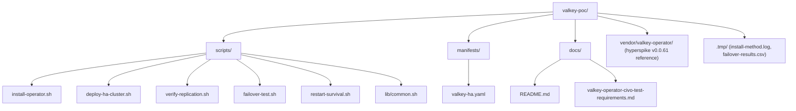

#README.md

## Prerequisites

Install in this order before running any script or manual check below.

### 1. valkey-cli (required)

Used by `failover-test.sh` (500 ms write probe via port-forward) and the manual sections below.

**Ubuntu/Debian (WSL or Linux):**

```sh
sudo apt-get update && sudo apt-get install -y valkey-tools
# If valkey-tools is unavailable on your release:
# sudo apt-get install -y redis-tools
# sudo ln -sf "$(command -v redis-cli)" /usr/local/bin/valkey-cli
valkey-cli --version
```

**macOS (Homebrew):**

```sh
brew install valkey
valkey-cli --version
```

**Build from source (any Linux):**

```sh
curl -sSL https://download.valkey.io/releases/valkey-8.1.4.tar.gz | tar xz
cd valkey-8.1.4 && make -j BUILD_TLS=no && sudo cp src/valkey-cli /usr/local/bin/
valkey-cli --version
```

### 2. kubectl v1.31+

Install from [kubernetes.io/docs/tasks/tools](https://kubernetes.io/docs/tasks/tools/). Confirm your kubeconfig targets the Civo K3s cluster:

```sh
kubectl config current-context
kubectl get nodes
```

### 3. jq

```sh
# Ubuntu/Debian
sudo apt-get install -y jq

# macOS
brew install jq
```

### 4. helm 3 (optional)

Only needed when installing the operator with `scripts/install-operator.sh --helm`.

```sh
# https://helm.sh/docs/intro/install/
helm version
```

## Repo structure



## Failover testing

Discover the current primary, delete it, and measure how long until the next write succeeds through the cluster service.

```sh
# Namespace and cluster name used by this PoC
NS=valkey
NAME=valkey-ha

# Password created by the operator
PASS=$(kubectl get secret "$NAME" -n "$NS" -o jsonpath='{.data.password}' | base64 -d)

# Find the primary pod (look for myself,master with slot range, not myself,slave)
PRIMARY=""
for POD in $(kubectl get pods -n "$NS" -l "app.kubernetes.io/instance=${NAME},app.kubernetes.io/name=valkey" -o name); do
  POD=${POD#pod/}
  ROLE=$(kubectl exec -n "$NS" "$POD" -c valkey -- valkey-cli --no-auth-warning -a "$PASS" -c CLUSTER NODES | grep 'myself,')
  if echo "$ROLE" | grep -q 'myself,master' && echo "$ROLE" | grep -qE '[0-9]+-[0-9]+'; then
    PRIMARY=$POD
    break
  fi
done
echo "Primary pod: $PRIMARY"

# Port-forward the Valkey service (keep this terminal open)
kubectl port-forward -n "$NS" "svc/${NAME}" 6379:6379 &
PF_PID=$!
sleep 2

# In another terminal: record kill time, delete primary, poll writes every 500 ms
T_KILL=$(date +%s)
kubectl delete pod -n "$NS" "$PRIMARY" --wait=false

while true; do
  if valkey-cli -h 127.0.0.1 -p 6379 --no-auth-warning -a "$PASS" -c PING \
    && valkey-cli -h 127.0.0.1 -p 6379 --no-auth-warning -a "$PASS" -c SET "valkey-test:failover:$(date +%s%N)" ok; then
    T_OK=$(date +%s)
    echo "RECOVERY_TIME_SECONDS=$((T_OK - T_KILL))"
    break
  fi
  sleep 0.5
done

kill "$PF_PID"
```

## Restart-survival

Write a key, scale the StatefulSet to zero, scale it back, and confirm the key still exists.

```sh
NS=valkey
NAME=valkey-ha
KEY=valkey-test:persistence
VAL=before-restart-$(date +%s)
PASS=$(kubectl get secret "$NAME" -n "$NS" -o jsonpath='{.data.password}' | base64 -d)
POD=$(kubectl get pods -n "$NS" -l "app.kubernetes.io/instance=${NAME},app.kubernetes.io/name=valkey" -o jsonpath='{.items[0].metadata.name}')
SVC=${NAME}.${NS}.svc.cluster.local

# 1. Write a persistence-check key through the cluster service
kubectl exec -n "$NS" "$POD" -c valkey -- \
  valkey-cli --no-auth-warning -a "$PASS" -h "$SVC" -c SET "$KEY" "$VAL"

# 2. Remember replica count, then scale down to 0
ORIG=$(kubectl get sts "$NAME" -n "$NS" -o jsonpath='{.spec.replicas}')
kubectl scale sts "$NAME" -n "$NS" --replicas=0
kubectl wait --for=delete --timeout=180s pod -l "app.kubernetes.io/instance=${NAME},app.kubernetes.io/name=valkey" -n "$NS" || true

# 3. Scale back up and wait for pods
kubectl scale sts "$NAME" -n "$NS" --replicas="$ORIG"
kubectl wait --for=condition=Ready --timeout=300s pod -l "app.kubernetes.io/instance=${NAME},app.kubernetes.io/name=valkey" -n "$NS"

# 4. Read the key back
POD=$(kubectl get pods -n "$NS" -l "app.kubernetes.io/instance=${NAME},app.kubernetes.io/name=valkey" -o jsonpath='{.items[0].metadata.name}')
kubectl exec -n "$NS" "$POD" -c valkey -- \
  valkey-cli --no-auth-warning -a "$PASS" -h "$SVC" -c GET "$KEY"
# Expected output: "$VAL"
```

## Key write

Write a test key on the primary and confirm it appears on each replica (direct pod read, bypassing the service).

```sh
NS=valkey
NAME=valkey-ha
KEY=valkey-test:replication
VAL=ok-$(date +%s)
PASS=$(kubectl get secret "$NAME" -n "$NS" -o jsonpath='{.data.password}' | base64 -d)

# Find primary pod
PRIMARY=""
for POD in $(kubectl get pods -n "$NS" -l "app.kubernetes.io/instance=${NAME},app.kubernetes.io/name=valkey" -o name); do
  POD=${POD#pod/}
  ROLE=$(kubectl exec -n "$NS" "$POD" -c valkey -- valkey-cli --no-auth-warning -a "$PASS" -c CLUSTER NODES | grep 'myself,')
  if echo "$ROLE" | grep -q 'myself,master' && echo "$ROLE" | grep -qE '[0-9]+-[0-9]+'; then
    PRIMARY=$POD
    break
  fi
done

# Write on primary and wait for 2 replicas to acknowledge
kubectl exec -n "$NS" "$PRIMARY" -c valkey -- \
  valkey-cli --no-auth-warning -a "$PASS" -c SET "$KEY" "$VAL"
kubectl exec -n "$NS" "$PRIMARY" -c valkey -- \
  valkey-cli --no-auth-warning -a "$PASS" -c WAIT 2 5000

# Read from each non-primary pod directly (READONLY avoids MOVED redirects)
for POD in $(kubectl get pods -n "$NS" -l "app.kubernetes.io/instance=${NAME},app.kubernetes.io/name=valkey" -o jsonpath='{.items[*].metadata.name}'); do
  [[ "$POD" == "$PRIMARY" ]] && continue
  echo -n "$POD: "
  kubectl exec -n "$NS" "$POD" -c valkey -- sh -c \
    "printf 'READONLY\r\nGET ${KEY}\r\n' | valkey-cli --no-auth-warning -a '${PASS}' -h 127.0.0.1 -p 6379 | tail -n1"
done
```
